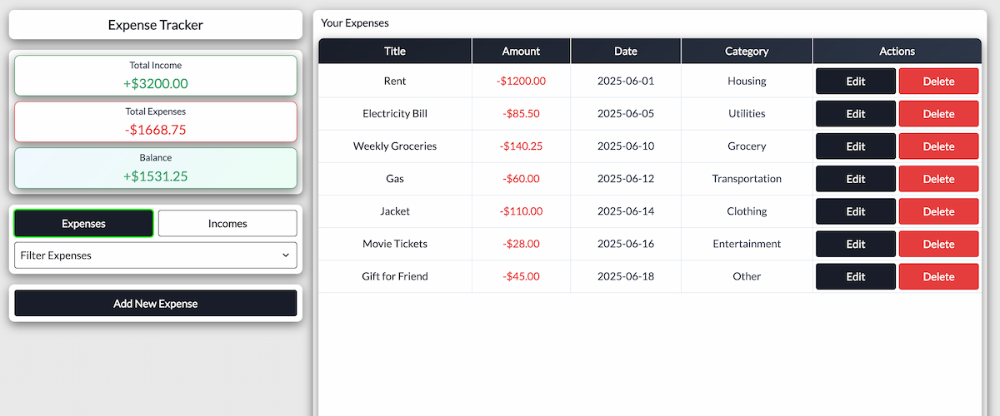

# Expense Tracker React



## Resources

### Netlify Deployment

[Live Project on Netlify](https://expense-tracker-ra.netlify.app/)

### GitHub Repository

[GitHub Repository Link](https://github.com/jerzyszajner/expense-tracker-react.git)

## Getting Started

### Prerequisites

- Node.js (version 18+)
- npm or yarn

### Installation

```bash
git clone https://github.com/jerzyszajner/expense-tracker-react.git
cd expense-tracker-react
npm install
npm run dev
```

## Technologies

- **React 19**
- **Vite**
- **UUID**: (unique transaction IDs)
- **CSS Modules**: (component styling)
- **LocalStorage**: (data persistence)
- **Responsive Design**: (desktop, tablet & mobile)

## Main Features

- **Transaction Management**: Add, edit, and delete income and expense transactions with form validation.

- **Categorization**: Organize transactions by predefined categories (housing, utilities, grocery, transportation, etc. for expenses; salary, freelance, investment, etc. for income).

- **Filtering & Sorting**: Filter transactions by category or month; view expenses and incomes separately.

- **Balance Summary**: Real-time calculation and display of total income, total expenses, and current balance with visual indicators.

- **Data Persistence**: All data automatically saved to browser's LocalStorage for offline access.

- **Responsive Design**: Optimized for desktop, tablet, and mobile devices with adaptive table layouts.

- **Modal Confirmations**: Safe deletion with confirmation dialogs to prevent accidental data loss.

## Component Features

### Transaction Management

- **Add Transactions**: Create new income or expense entries with title, amount, date, and category
- **Edit Transactions**: Modify existing entries with pre-populated form data
- **Delete Transactions**: Remove transactions with confirmation modal

### Data Visualization

- **Balance Cards**: Visual summary showing total income (green), total expenses (red), and net balance
- **Transaction Tables**: Responsive tables with conditional styling based on transaction type
- **Empty States**: Friendly messages when no transactions exist

### User Experience

- **Form Validation**: Real-time validation for required fields and numeric amounts
- **Success Messages**: Confirmation feedback when transactions are added or updated
- **Responsive Tables**: Mobile-optimized layouts that hide non-essential columns on smaller screens
- **Keyboard Navigation**: Full keyboard support with ESC key modal closing

## Brief Description

Expense Tracker is a personal finance management application where users can:

- Track income and expenses across multiple categories
- View real-time balance calculations and financial summaries
- Filter transactions by category or month for better insights
- Manage transactions with full CRUD operations (Create, Read, Update, Delete)
- Access data offline with automatic LocalStorage persistence
- Enjoy a responsive interface that works on all device sizes

The application emphasizes simplicity and usability, making personal finance tracking accessible without requiring external accounts or internet connectivity.

## Credits

- **Inspiration**: Modern personal finance apps and minimalist design principles
- **GPT/AI**: Assisted with debugging

## License

- MIT © Jerzy Szajner: [License.txt](License.txt)

## Contact

- [jerzy.szajner@gmail.com](mailto:jerzy.szajner@gmail.com)
- [LinkedIn](https://www.linkedin.com/in/jerzyszajner/)
